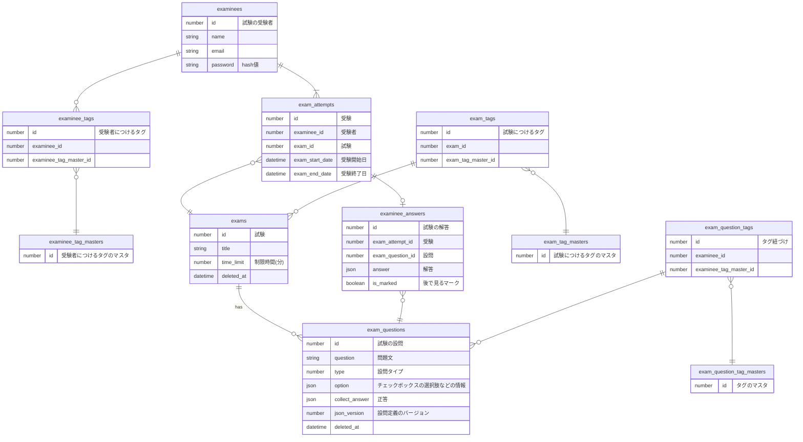

めも
- examinees
  - 今のところcognitoは検討していない
    - 金かかる
    - そこまでセキュリティガチらなくていい
    - ユーザ設定をずっと使うわけではないので、パスワード再設定機能等がオーバースペック
  - 人事アプリとの連携を念頭に置く
- exams
  - 過去に受験した試験内容を変えてしまわないよう、論理削除で扱う
  - 出題順やカテゴリーなどの情報も追加していきたいかも
- exam_questions
  - type
    - チェックボックス | ラジオボタン | テキスト
    - 並べ変えリストとか画像のアップロードも追加していきたいかも
  - option
    - jsonで、どんな選択肢があるかを定義

※ 各テーブルcreated_at, updated_at 略
※ 各jsonについては定義書参照

