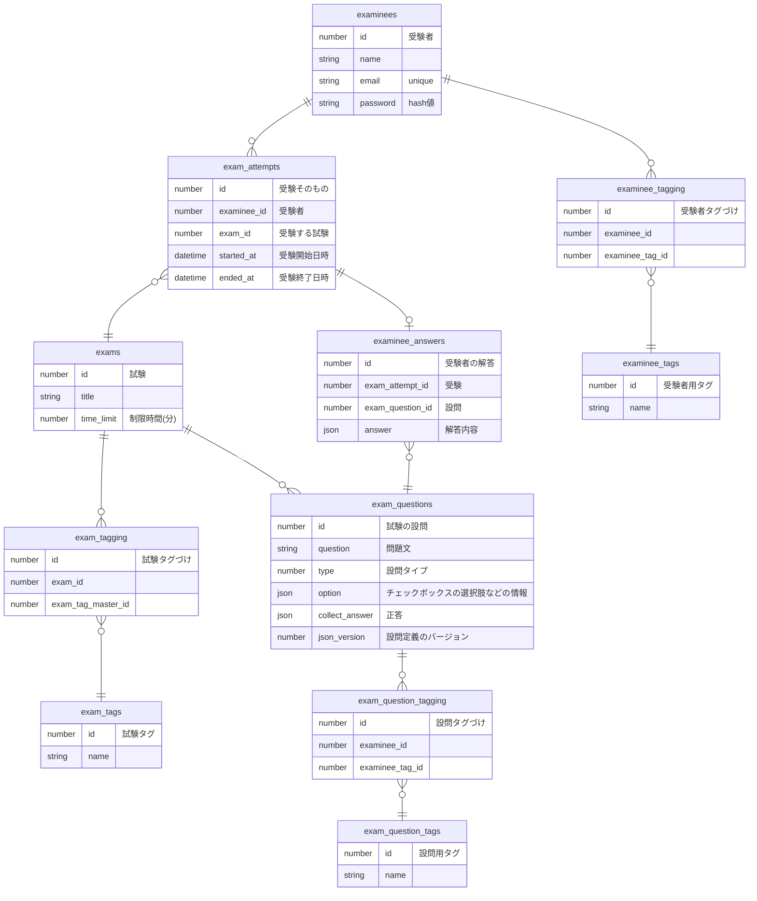

めも
- 各テーブルでcreated_at, updated_at, deleted_at カラムを持つ
  - ER図からは省略
  - 全部論理削除で扱う
- 受験者の回答や設問の設定はjson形式で保存している
  - jsonの定義は定義書作るまではコード見てもろて
- 試験や問題のバージョニングは不要
  - 最新のだけで出問したり集計したりでOK
- 設問タイプについて、0: テキスト、1: ラジオボタン、2: チェックボックス

